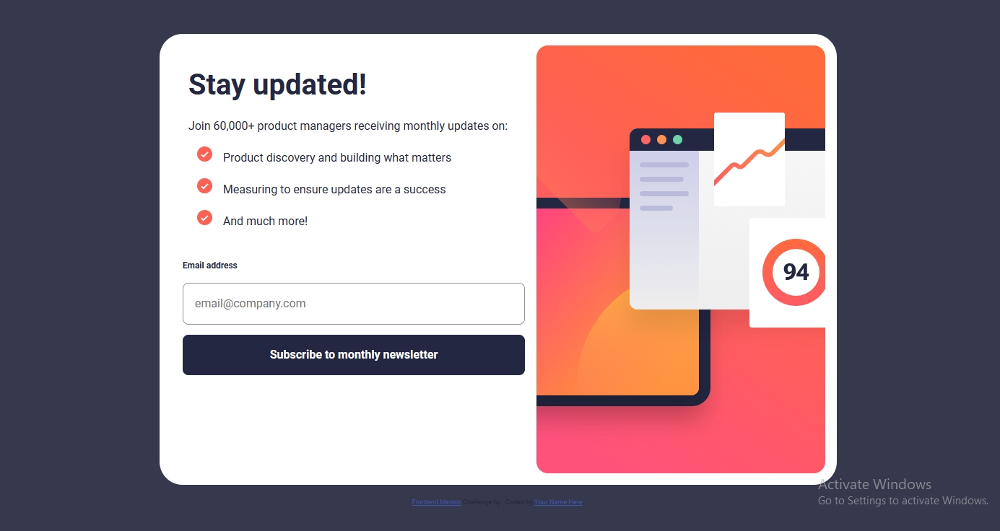
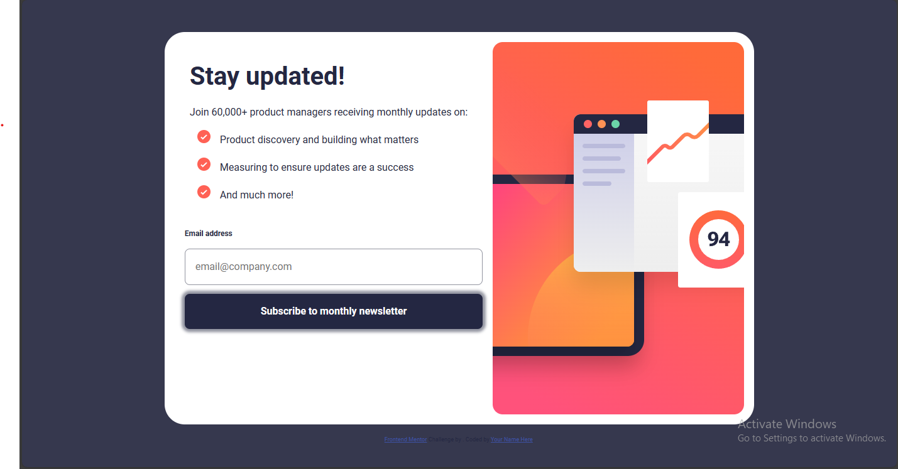
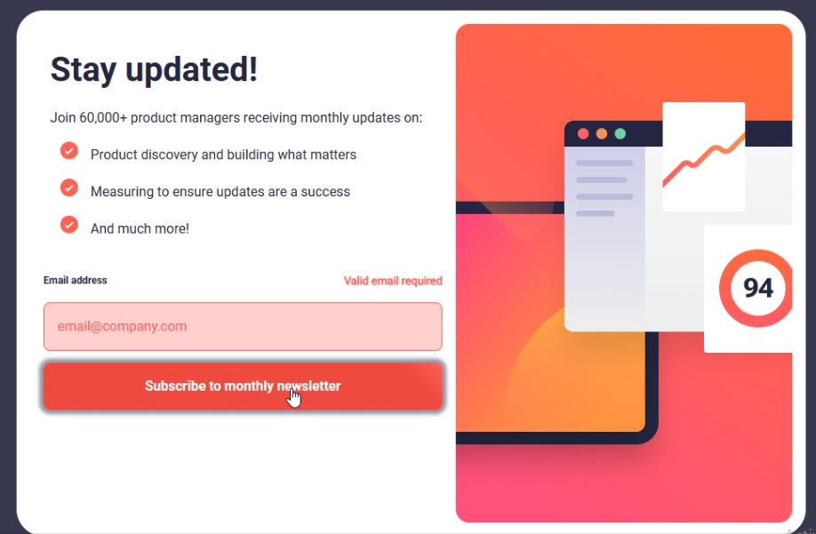
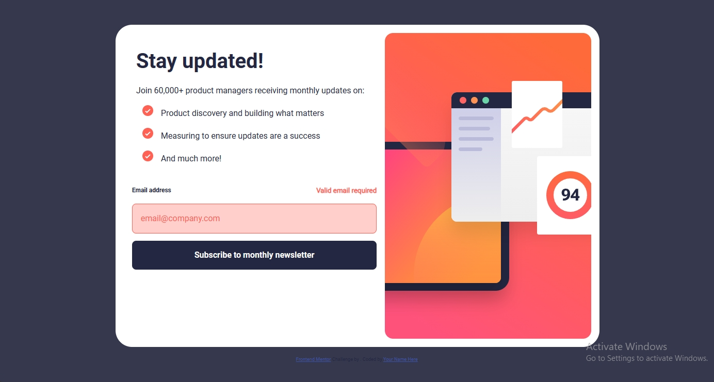
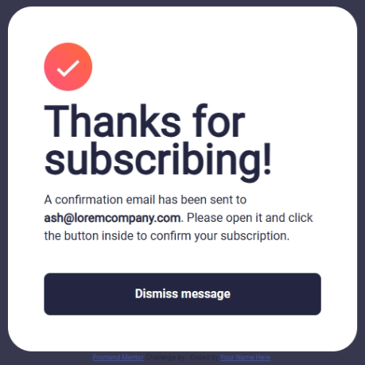
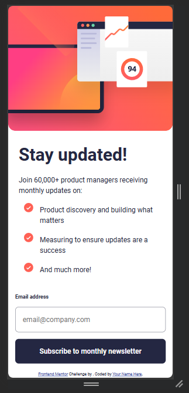
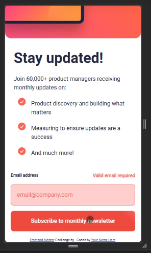
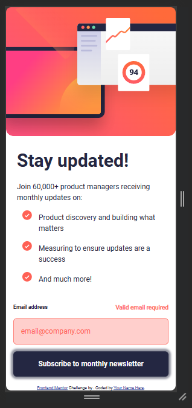
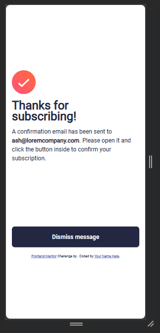

# Frontend Mentor - Newsletter sign-up form with success message solution

This is a solution to the [Newsletter sign-up form with success message challenge on Frontend Mentor](https://www.frontendmentor.io/challenges/newsletter-signup-form-with-success-message-3FC1AZbNrv). Frontend Mentor challenges help you improve your coding skills by building realistic projects.

## Table of contents

- [Overview](#overview)
  - [The challenge](#the-challenge)
  - [Screenshot](#screenshot)
  - [Desktop Mode](#desktop-mode)
    - [Button](#button)
      - [Focus/Hover](#focushover)
      - [Active](#active)
    - [Status](#status)
      - [Error](#error)
      - [Success](#success)
  - [Desktop Mode](#desktop-mode)
    - [Button](#button-1)
      - [Focus/Hover](#focushover-1)
      - [Active](#active-1)
    - [Status](#status-1)
      - [Error](#error-1)
      - [Success](#success-1)
  - [Links](#links)
- [My process](#my-process)
  - [Built with](#built-with)
  - [What I learned](#what-i-learned)
  - [Continued development](#continued-development)
  - [Useful resources](#useful-resources)
- [Author](#author)
- [Acknowledgments](#acknowledgments)

---

## Overview

### The challenge

Users should be able to:

- Add their email and submit the form
- See a success message with their email after successfully submitting the form
- See form validation messages if:
  - The field is left empty
  - The email address is not formatted correctly
- View the optimal layout for the interface depending on their device's screen size
- See hover and focus states for all interactive elements on the page

---

### Screenshot

#### Desktop Mode:



- ##### Button

1. ###### Focus/Hover:

   

2. ###### Active:

   

- ##### Status:

1. ###### Error

   

2. ###### Success:
   

#### Mobile Mode:



- ##### Button

1. ###### Focus/Hover:

   

2. ###### Active:

   

- ##### Status:

1. ###### Error

   

2. ###### Success:
   

### Links

- Solution URL: [Github](https://github.com/SerPet-eng/News_Letter_Sign_Up_With_Success_Message)
- Live Site URL: [Netlify](https://inquisitive-otter-5f8f77.netlify.app/)

## My process

### Built with

- Semantic HTML5 markup
- SASS Variables
- Flexbox
- CSS Grid
- Mobile-first workflow
- [React](https://reactjs.org/) - JS library
- [React Router 6](https://reactrouter.com/en/main) - React Routing Library
- [SASS](https://sass-lang.com/) - SASS Preprocessor

---

### What I learned

The major thing I've learn from this challenge is the use of **React Router 6** in this project. I took my time to learn the basics and fundamentals of it and I get the gist of it.

```jsx
import { BrowserRouter as Router, Routes, Route } from 'react-router-dom';
import SignUp from './components/SignUp';
import Success from './components/Success';
import Footer from './components/Footer';

export default function App() {
  return (
    <>
      <Router>
        <Routes>
          <Route path="/" element={<SignUp />} />
          <Route path="/success" element={<Success />} />
        </Routes>
        <Footer />
      </Router>
    </>
  );
}
```

**AND THIS ONE AS WELL**

```jsx
import { useState } from 'react';
import { useNavigate } from 'react-router-dom';

export default function Form() {
  const [value, setValue] = useState('');
  const [error, setError] = useState(null);
  const navigate = useNavigate();

  // other codes...
}
```

> This `useNavigate` really do the trick when routing a component like in this challenge (`Success.jsx`).

```jsx
const handleSignUp = (e) => {
  e.preventDefault();
  if (isEmail(value)) {
    navigate('/success');
    setError(null);
  } else {
    setError('Valid email required');
  }
};

const isEmail = (email) => {
  const emailRegex = /^[^\s@]+@[^\s@]+\.[^\s@]+$/;
  return emailRegex.test(email);
};
```

> The _first_ function `handleSignup()` which has a condition that check if the `value` is an "email". The _second_ function where the **input form** will check if the value is an "email"

**From style.scss**

```scss
@import './main/body';
@import './main/content';
@import './main/footer';
@import './main/reset';
@import './main/form';
@import './main/success';
```

> After watching some tutorial video on YouTube, I learn that using `@import` to use variables in a different file is 'must not to do'. This is where the `variable.scss`.

**From variable.scss**

```scss
@forward './colors';
@forward './font-family';
@forward './font-weight';

$screen-desktop: 500px;
```

> This make using variable have some control, because according to the documents and the video tutorial that I've watched, it said that using **_@use_** or **_@forward_** allows you to **_allias_** modules providing _better control_ over the names of imported items.

---

### Useful resources

- [Kevin Powell's video about @use and @forward](https://www.youtube.com/watch?v=CR-a8upNjJ0&pp=ygURa2V2aW4gcG93ZWxsIEB1c2U%3D) - This tutorial video by [Kevin Powell](https://www.youtube.com/@KevinPowell) really helps me to understand this two concept of SASS, the `_**@use**_` and `_**@forward**_`
- [W3school](https://www.w3schools.com) - This website really helps me to refresh some concept of a code that I've forgotten
- [MDN Docs](https://developer.mozilla.org/zh-CN/) - Also this website helps when I need a further understand of said concept.

## Author

- Website - [Netlify - Fate](https://inquisitive-otter-5f8f77.netlify.app/)
- Frontend Mentor - [@SerPet-eng](https://www.frontendmentor.io/profile/SerPet-eng)
- Twitter - [@dchristian796](https://twitter.com/dchristian796)

## Acknowledgments

I want to acknowledge my family and friends for supporting me and for my specific inspiration in terms of Frontend Developing. First of [Hattori Hanzo](https://www.facebook.com/areyes2022) and [Kevin Powell](https://www.youtube.com/@KevinPowell). Also to God himself. Oneself will forever be grateful for everyday blessing.
