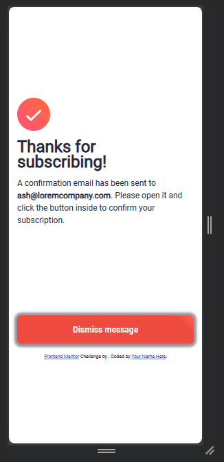

# Frontend Mentor - Newsletter sign-up form with success message solution

This is a solution to the [Newsletter sign-up form with success message challenge on Frontend Mentor](https://www.frontendmentor.io/challenges/newsletter-signup-form-with-success-message-3FC1AZbNrv). Frontend Mentor challenges help you improve your coding skills by building realistic projects.

## Table of contents

- [Overview](#overview)
  - [The challenge](#the-challenge)
  - [Screenshot](#screenshot)
  - [Links](#links)
- [My process](#my-process)
  - [Built with](#built-with)
  - [What I learned](#what-i-learned)
  - [Continued development](#continued-development)
  - [Useful resources](#useful-resources)
- [Author](#author)
- [Acknowledgments](#acknowledgments)

## Overview

### The challenge

Users should be able to:

- Add their email and submit the form
- See a success message with their email after successfully submitting the form
- See form validation messages if:
  - The field is left empty
  - The email address is not formatted correctly
- View the optimal layout for the interface depending on their device's screen size
- See hover and focus states for all interactive elements on the page

### Screenshot

#### Desktop Mode:


- ##### Button

1. ###### Focus/Hover:

   

2. ###### Active:

   

- ##### Status:

1. ###### Error

   

2. ###### Success:
   

- ##### Effects:

  1. ###### Focus/Hover

     

  2. ###### Desktop Success Active:
     

#### Mobile Mode:


- ##### Button

<!-- 1. ###### Focus/Hover:

    -->

2. ###### Active:

   

- ##### Status:

1. ###### Error

   

2. ###### Success:
   

- ##### Effects:

  <!-- 1. ###### Focus/Hover

      -->

  2. ###### Mobile Success Active:
     

### Links

- Solution URL: [Add solution URL here](https://your-solution-url.com)
- Live Site URL: [Add live site URL here](https://your-live-site-url.com)

## My process

### Built with

- Semantic HTML5 markup
- CSS custom properties
- Flexbox
- CSS Grid
- Mobile-first workflow
- [React](https://reactjs.org/) - JS library
- [Next.js](https://nextjs.org/) - React framework
- [Styled Components](https://styled-components.com/) - For styles

**Note: These are just examples. Delete this note and replace the list above with your own choices**

### What I learned

Use this section to recap over some of your major learnings while working through this project. Writing these out and providing code samples of areas you want to highlight is a great way to reinforce your own knowledge.

To see how you can add code snippets, see below:

```html
<h1>Some HTML code I'm proud of</h1>
```

```css
.proud-of-this-css {
  color: papayawhip;
}
```

```js
const proudOfThisFunc = () => {
  console.log('🎉');
};
```

If you want more help with writing markdown, we'd recommend checking out [The Markdown Guide](https://www.markdownguide.org/) to learn more.

**Note: Delete this note and the content within this section and replace with your own learnings.**

### Continued development

Use this section to outline areas that you want to continue focusing on in future projects. These could be concepts you're still not completely comfortable with or techniques you found useful that you want to refine and perfect.

**Note: Delete this note and the content within this section and replace with your own plans for continued development.**

### Useful resources

- [Example resource 1](https://www.example.com) - This helped me for XYZ reason. I really liked this pattern and will use it going forward.
- [Example resource 2](https://www.example.com) - This is an amazing article which helped me finally understand XYZ. I'd recommend it to anyone still learning this concept.

**Note: Delete this note and replace the list above with resources that helped you during the challenge. These could come in handy for anyone viewing your solution or for yourself when you look back on this project in the future.**

## Author

- Website - [Add your name here](https://www.your-site.com)
- Frontend Mentor - [@yourusername](https://www.frontendmentor.io/profile/yourusername)
- Twitter - [@yourusername](https://www.twitter.com/yourusername)

**Note: Delete this note and add/remove/edit lines above based on what links you'd like to share.**

## Acknowledgments

This is where you can give a hat tip to anyone who helped you out on this project. Perhaps you worked in a team or got some inspiration from someone else's solution. This is the perfect place to give them some credit.

**Note: Delete this note and edit this section's content as necessary. If you completed this challenge by yourself, feel free to delete this section entirely.**
